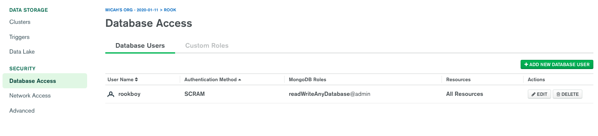
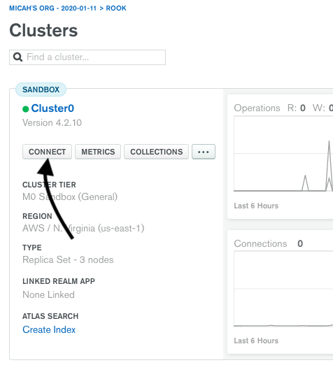
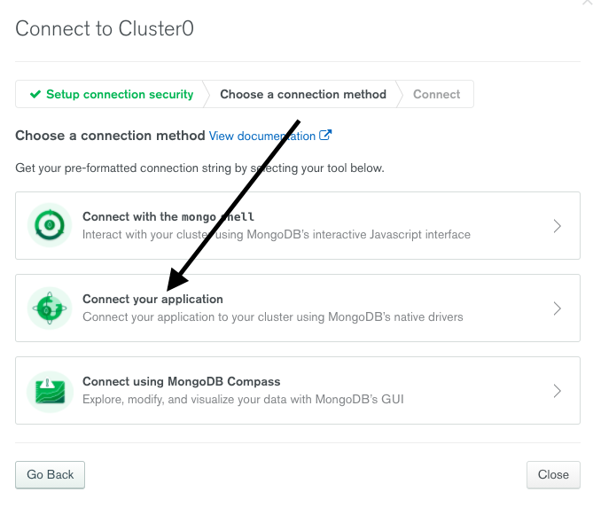
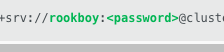
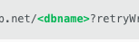
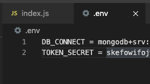

To get the server connected to a mongodb database you need to create a database at https://www.mongodb.com/cloud/atlas

Once you have the free version created connect to database by adding your current ip address to the database access:

Now go to connect to the database under clusers

Now select connect to your app

In the url provided replace the username and password with your username and password

You can use the name test for to replace <dbname> in 
  

Now create a .env file in the server directory and define the following two variables

The TOKEN_SECRET is used to hash passwords and the DB_CONNECT is used in the index.js to connect to your database

Now enter npm run start to start up the server and you should be able to write to your database.
